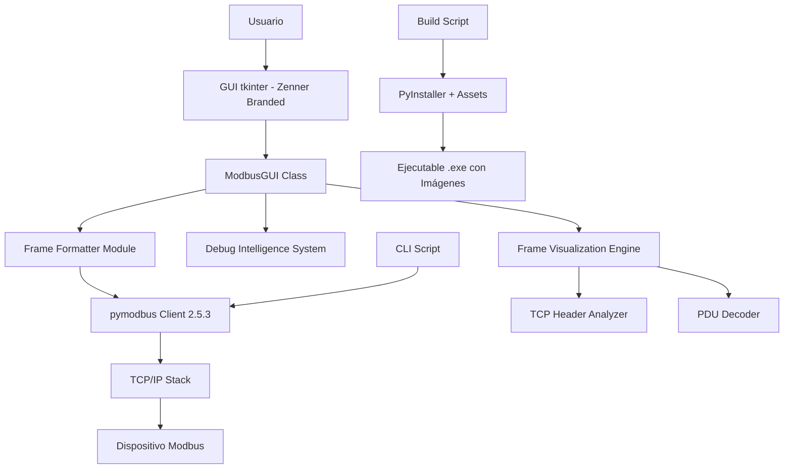

# 🔬 DOCUMENTACIÓN TÉCNICA - MODBUS TCP POLL ZENNER

## 🏗️ Arquitectura del Sistema

### Componentes Principales



### Tecnologías Utilizadas

| Componente | Tecnología | Versión | Propósito |
|------------|------------|---------|-----------|
| GUI Framework | tkinter | Built-in Python | Interfaz gráfica multiplataforma |
| Modbus Library | pymodbus | 2.5.3 | Comunicación Modbus TCP/RTU (compatibilidad) |
| Image Processing | PIL/Pillow | Latest | Manejo de logos y favicon |
| Packaging | PyInstaller | 6.16+ | Crear ejecutables con assets |
| Threading | threading | Built-in Python | Operaciones no bloqueantes |
| Date/Time | datetime | Built-in Python | Timestamps y logs |

## � Nuevas Funcionalidades - Visualización de Tramas

### Sistema de Análisis de Tramas TCP/PDU

**Funciones Principales de Formateo:**

```python
def format_modbus_tcp_frame(transaction_id, protocol_id, length, unit_id, function_code, data_bytes=None):
    """
    Formatea el header Modbus TCP completo
    - Transaction ID (2 bytes)
    - Protocol ID (2 bytes) 
    - Length (2 bytes)
    - Unit ID (1 byte)
    """

def format_modbus_pdu(func_code, data_bytes):
    """
    Formatea el Protocol Data Unit
    - Function Code con nombre descriptivo
    - Análisis específico por tipo de función
    - Desglose de direcciones y datos
    """

def format_modbus_request(func_code, address, data, unit_id=1):
    """
    Construye trama de petición completa
    - Header TCP simulado
    - PDU según tipo de función
    - Validación de parámetros
    """

def format_modbus_response(func_code, response, operation_desc):
    """
    Procesa trama de respuesta
    - Análisis de respuestas exitosas y de error
    - Formateo específico por función
    - Decodificación de datos
    """

def get_function_name(func_code):
    """
    Traduce códigos de función a nombres descriptivos
    FC01-FC16 con nombres completos en inglés
    """
```

### Análisis Detallado por Función Modbus

#### Funciones de Lectura (FC01-FC04)
```python
# Petición
PDU = [
    address_hi, address_lo,    # Dirección inicial (2 bytes)
    count_hi, count_lo         # Cantidad a leer (2 bytes)
]

# Respuesta
PDU = [
    byte_count,                # Cantidad de bytes de datos
    data_bytes...              # Datos leídos
]
```

#### Funciones de Escritura Simple (FC05-FC06)
```python
# Petición
PDU = [
    address_hi, address_lo,    # Dirección (2 bytes)
    value_hi, value_lo         # Valor a escribir (2 bytes)
]

# Respuesta (eco)
PDU = [
    address_hi, address_lo,    # Misma dirección
    value_hi, value_lo         # Mismo valor confirmado
]
```

#### Funciones de Escritura Múltiple (FC15-FC16)
```python
# Petición
PDU = [
    address_hi, address_lo,    # Dirección inicial (2 bytes)
    count_hi, count_lo,        # Cantidad de elementos (2 bytes)
    byte_count,                # Bytes de datos que siguen
    data_bytes...              # Datos a escribir
]
```

## 📁 Estructura de Archivos Actualizada

### `modbus_gui.py` - Aplicación Principal GUI

**Clase Principal: `ModbusGUI`**

```python
class ModbusGUI:
    def __init__(self, root):
        # Inicialización con ventana maximizada
        # Logo Zenner integrado
        # Configuración de estilos Zenner
    
    # Métodos de interfaz mejorados
    def create_interface(self)          # Interface con branding
    def create_left_panel(self, parent) # Panel de configuración
    def create_right_panel(self, parent)# Panel con análisis de tramas
    def create_debug_area(self)         # Área de debug expandida
    
    # Métodos de conexión
    def connect_to_device(self)         # Conexión con validación
    def disconnect_from_device(self)    # Desconexión limpia
    
    # Sistema de envío con análisis
    def send_modbus_request(self)       # Envío con captura de tramas
    def on_response_received(self, response, operation_desc, func_num)
                                       # Procesamiento con visualización completa
    
    # Sistema de debug inteligente
    def show_error_debug(self, error_msg, error_type, suggested_fixes)
    def show_success_debug(self, func_num, operation_desc)
    def update_debug_area(self, message, level="info")
    
    # Utilidades de recursos
    def get_resource_path(self, relative_path)  # Manejo de paths ejecutable/dev
```

### Nuevos Módulos de Análisis

#### **Frame Analysis Engine**
- Análisis completo de headers TCP
- Decodificación de PDUs por función
- Formateo hexadecimal y decimal
- Identificación de errores de protocolo

#### **Debug Intelligence System**
- Detección automática de errores comunes
- Sugerencias contextuales específicas
- Validación en tiempo real
- Mensajes de estado descriptivos

## 🎨 Sistema de Branding Zenner

### Recursos Gráficos
```python
ZENNER_LOGO = "Zenner Tecnologia FONDOS CLAROS - chicos.png"  # 13287 bytes
ZENNER_FAVICON = "zenner-ico-sinfondo.ico"                    # 26987 bytes

def get_resource_path(relative_path):
    """Maneja paths para desarrollo y ejecutable"""
    if hasattr(sys, '_MEIPASS'):
        return os.path.join(sys._MEIPASS, relative_path)
    return os.path.join(os.path.abspath("."), relative_path)
```

### Configuración Visual
- **Ventana maximizada** al inicio
- **Logo posicionado** en esquina superior derecha
- **Favicon** como icono de ventana y ejecutable
- **Colores corporativos** en elementos de estado

## 🔧 Mejoras Técnicas Implementadas

### Sistema de Threading Mejorado
```python
def send_request_threaded(self):
    """Envío no bloqueante con captura de tramas"""
    self.send_btn.config(text="⏳ Enviando...", state="disabled")
    
    thread = threading.Thread(
        target=self.execute_modbus_operation,
        args=(func_num, operation_desc),
        daemon=True
    )
    thread.start()
```

### Validación de Datos Robusta
```python
def validate_connection_params(self):
    """Validación completa de parámetros de conexión"""
    # Validar IP, puerto, Unit ID
    # Verificar rangos válidos
    # Sugerencias automáticas de corrección

def validate_modbus_params(self, func_num):
    """Validación específica por función Modbus"""
    # Rangos de direcciones válidas
    # Límites de cantidad de datos
    # Formatos de valores de escritura
```

## 🏗️ Build System Actualizado

### `build_exe.py` - Script de Construcción

```python
def build_exe():
    """Construcción con inclusión de assets"""
    cmd = [
        "pyinstaller",
        "--onefile",                    # Ejecutable único
        "--windowed",                   # Sin consola
        "--name", "ModbusPoll-Zenner-v2",
        "--add-data", "img;img",        # Incluir imágenes
        "--icon", "img/zenner-ico-sinfondo.ico",  # Favicon
        "modbus_gui.py"
    ]
```

### Inclusión de Assets
- **Verificación automática** de imágenes antes del build
- **Empaquetado correcto** de recursos en el ejecutable
- **Manejo de paths** diferenciado para desarrollo/producción

## 📊 Métricas de Rendimiento

### Análisis de Código
```
Total de líneas: ~1,100 (vs ~450 en v2.0.0)
Nuevas funciones: 15
Funciones de análisis de tramas: 8
Mejoras en UI: 12 métodos actualizados
```

### Funcionalidades por Versión
| Característica | v2.0.0 | v2.2.0 |
|---------------|--------|--------|
| Funciones Modbus | 8 | 8 |
| Análisis de tramas | ❌ | ✅ Completo |
| Header TCP | ❌ | ✅ |
| PDU Analysis | ❌ | ✅ |
| Debug inteligente | Básico | ✅ Avanzado |
| Branding Zenner | Logo | ✅ Completo |
| Timestamps | ❌ | ✅ |

## 🔒 Compatibilidad y Seguridad

### Compatibilidad pymodbus 2.5.3
```python
# Sintaxis compatible para todas las versiones
client.read_holding_registers(
    address=address,
    count=count,
    unit=unit_id
)

# Verificación de errores compatible
if hasattr(response, 'isError') and response.isError():
    # Manejo de error
```

### Manejo de Recursos
- **Detección automática** de PIL/Pillow
- **Fallback graceful** si las imágenes no están disponibles
- **Paths seguros** para ejecutable y desarrollo
    def toggle_connection(self)
    
    # Métodos de comunicación Modbus
    def send_modbus_request(self)
    def execute_modbus_operation(self, client, function, unit_id)
    
    # Métodos de utilidad
    def update_frame_preview(self)
    def on_response_received(self, response, operation_desc, func_num)
    def add_response_log(self, message, tag)
```

**Flujo de Ejecución:**
1. **Inicialización:** Crear ventana principal y componentes
2. **Configuración:** Usuario ingresa parámetros de conexión
3. **Conexión:** Establecer comunicación TCP con dispositivo
4. **Operación:** Enviar trama Modbus y recibir respuesta
5. **Visualización:** Formatear y mostrar resultados

### `modbus_zenner.py` - Versión CLI

**Funciones Principales:**

```python
def obtener_configuracion_conexion()  # Input de IP, puerto, Unit ID
def mostrar_menu_funciones()          # Menú de funciones Modbus
def obtener_parametros_lectura()      # Parámetros para FC01-04
def obtener_parametros_escritura_simple()    # Parámetros para FC05-06
def obtener_parametros_escritura_multiple()  # Parámetros para FC15-16
def ejecutar_operacion_modbus()       # Ejecución de comando Modbus
def mostrar_respuesta()               # Formateo de respuesta
def main()                           # Bucle principal del programa
```

### `build_exe.py` - Script de Construcción

**Funcionalidades:**
- Verificación automática de PyInstaller
- Instalación de dependencias faltantes
- Configuración de parámetros de empaquetado
- Generación de ejecutable optimizado

## 🔧 Detalles de Implementación

### Threading y Concurrencia

**Problema:** Las operaciones Modbus pueden tomar tiempo, bloqueando la GUI

**Solución:**
```python
def connect_to_device(self):
    def connect_thread():
        try:
            if self.client.connect():
                self.root.after(0, self.on_connection_success)
            else:
                self.root.after(0, lambda: self.on_connection_error("..."))
        except Exception as e:
            self.root.after(0, lambda: self.on_connection_error(str(e)))
    
    thread = threading.Thread(target=connect_thread, daemon=True)
    thread.start()
```

**Características:**
- Threads daemon para limpieza automática
- `root.after()` para thread-safe GUI updates
- Manejo de excepciones en threads separados

### Manejo de Errores

**Niveles de Error:**
1. **Validación de Input:** Verificación de tipos y rangos
2. **Errores de Conexión:** Timeout, host unreachable
3. **Errores Modbus:** Exception codes, invalid responses
4. **Errores de GUI:** Thread safety, widget destruction

**Estrategia de Manejo:**
```python
try:
    # Operación riesgosa
    response = client.read_holding_registers(...)
    if response.isError():
        # Error específico de Modbus
        self.handle_modbus_error(response)
    else:
        # Procesar respuesta exitosa
        self.process_response(response)
except ConnectionException:
    # Error de conexión de red
    self.handle_connection_error()
except ModbusException:
    # Error específico del protocolo
    self.handle_protocol_error()
except Exception as e:
    # Error genérico
    self.handle_generic_error(e)
```

### Formateo de Datos

**Registros de 16 bits:**
```python
def format_register_data(self, registers):
    decimal_values = registers
    hex_values = [f"0x{reg:04X}" for reg in registers]
    binary_values = [f"{reg:016b}" for reg in registers]
    
    return {
        'decimal': decimal_values,
        'hex': hex_values, 
        'binary': binary_values
    }
```

**Coils/Discrete Inputs:**
```python
def format_bit_data(self, bits):
    return [bool(bit) for bit in bits]
```

## 🌐 Protocolo Modbus TCP

### Frame Structure

**ADU (Application Data Unit):**
```
| MBAP Header (7 bytes) | PDU (1-253 bytes) |
```

**MBAP Header:**
```
| Transaction ID (2) | Protocol ID (2) | Length (2) | Unit ID (1) |
```

**PDU (Protocol Data Unit):**
```
| Function Code (1) | Data (0-252 bytes) |
```

### Funciones Implementadas

| Código | Función | Tipo | Descripción |
|--------|---------|------|-------------|
| 01 | Read Coils | Lectura | Lee estado de salidas digitales |
| 02 | Read Discrete Inputs | Lectura | Lee estado de entradas digitales |
| 03 | Read Holding Registers | Lectura | Lee registros de datos principales |
| 04 | Read Input Registers | Lectura | Lee registros de solo lectura |
| 05 | Write Single Coil | Escritura | Escribe una salida digital |
| 06 | Write Single Register | Escritura | Escribe un registro |
| 15 | Write Multiple Coils | Escritura | Escribe múltiples salidas |
| 16 | Write Multiple Registers | Escritura | Escribe múltiples registros |

### Ejemplo de Trama TCP

**Lectura de 2 Holding Registers desde dirección 0:**
```
Request:
[00 01] [00 00] [00 06] [01] [03] [00 00] [00 02]
 TxID   Proto   Length  Unit  FC   Addr    Count

Response:
[00 01] [00 00] [00 07] [01] [03] [04] [12 34] [56 78]
 TxID   Proto   Length  Unit  FC  Bytes  Reg0   Reg1
```

## 🔒 Seguridad y Validación

### Validación de Entrada

```python
def validate_ip_address(ip_string):
    try:
        ipaddress.ip_address(ip_string)
        return True
    except ValueError:
        return False

def validate_port(port_string):
    try:
        port = int(port_string)
        return 1 <= port <= 65535
    except ValueError:
        return False

def validate_modbus_address(address_string):
    try:
        address = int(address_string)
        return 0 <= address <= 65535
    except ValueError:
        return False
```

### Límites y Restricciones

| Parámetro | Mínimo | Máximo | Notas |
|-----------|---------|---------|-------|
| Dirección Modbus | 0 | 65535 | 16-bit address space |
| Cantidad de Registros | 1 | 125 | Limitado por MTU TCP |
| Unit ID | 1 | 247 | Según especificación Modbus |
| Puerto TCP | 1 | 65535 | Puerto 502 es estándar |

## 📊 Optimización y Performance

### Estrategias de Optimización

1. **Batch Reading:** Leer múltiples registros en una sola operación
2. **Connection Pooling:** Reutilizar conexiones TCP
3. **Timeout Optimization:** Ajustar timeouts según latencia de red
4. **Memory Management:** Limpiar objetos de respuesta grandes

### Métricas de Performance

```python
class PerformanceMetrics:
    def __init__(self):
        self.request_count = 0
        self.success_count = 0
        self.error_count = 0
        self.total_response_time = 0
        
    def log_request(self, start_time, end_time, success):
        self.request_count += 1
        response_time = end_time - start_time
        self.total_response_time += response_time
        
        if success:
            self.success_count += 1
        else:
            self.error_count += 1
    
    @property
    def average_response_time(self):
        if self.request_count == 0:
            return 0
        return self.total_response_time / self.request_count
    
    @property
    def success_rate(self):
        if self.request_count == 0:
            return 0
        return (self.success_count / self.request_count) * 100
```

## 🔧 Configuración Avanzada

### Parámetros de pymodbus

```python
# Configuración del cliente con timeouts personalizados
client = ModbusTcpClient(
    host="192.168.1.100",
    port=502,
    timeout=3,          # Timeout de conexión (segundos)
    # En pymodbus 2.5.3, algunos parámetros son diferentes
    framer=None,        # Frame por defecto
    source_address=None  # IP local específica (opcional)
)
```

### Logging Avanzado

```python
import logging

def setup_logging():
    # Configurar logging para pymodbus
    logging.basicConfig(level=logging.DEBUG)
    
    # Logger específico para la aplicación
    app_logger = logging.getLogger('modbus_gui')
    handler = logging.FileHandler('modbus_operations.log')
    formatter = logging.Formatter(
        '%(asctime)s - %(name)s - %(levelname)s - %(message)s'
    )
    handler.setFormatter(formatter)
    app_logger.addHandler(handler)
    
    return app_logger
```

## 🧪 Testing y Depuración

### Unit Tests

```python
import unittest
from unittest.mock import Mock, patch

class TestModbusOperations(unittest.TestCase):
    def setUp(self):
        self.gui = ModbusGUI(Mock())
        
    def test_validate_ip_address(self):
        self.assertTrue(self.gui.validate_ip("192.168.1.100"))
        self.assertFalse(self.gui.validate_ip("invalid_ip"))
        
    @patch('pymodbus.client.ModbusTcpClient')
    def test_connection(self, mock_client):
        mock_client.return_value.connect.return_value = True
        result = self.gui.connect_to_device()
        self.assertTrue(result)
```

### Herramientas de Depuración

1. **Wireshark:** Captura de tráfico TCP/Modbus
2. **Modbus Slave Simulator:** Testing sin hardware real
3. **Python Debugger:** pdb para debugging interactivo

## 📈 Escalabilidad y Extensiones

### Extensiones Futuras

1. **Soporte Modbus RTU:** Puerto serie
2. **Configuraciones Guardadas:** Perfiles de dispositivos
3. **Scripting:** Automatización de secuencias
4. **Logging a Base de Datos:** Almacenamiento de historial
5. **REST API:** Interfaz web para operaciones remotas

### Arquitectura Modular

```python
# Ejemplo de extensión para Modbus RTU
class ModbusRTUHandler(ModbusHandler):
    def __init__(self, port, baudrate, timeout):
        self.client = ModbusSerialClient(
            method='rtu',
            port=port,
            baudrate=baudrate,
            timeout=timeout
        )
    
    def connect(self):
        return self.client.connect()
    
    def read_registers(self, address, count, unit):
        return self.client.read_holding_registers(address, count, unit)
```

## 🔄 Mantenimiento y Actualizaciones

### Versionado

- **Mayor.Menor.Parche** (Semantic Versioning)
- **Mayor:** Cambios incompatibles en API
- **Menor:** Nuevas funcionalidades compatibles
- **Parche:** Corrección de bugs

### Proceso de Release

1. **Testing:** Ejecutar suite de tests completa
2. **Documentación:** Actualizar manuales y changelog
3. **Building:** Crear nuevo ejecutable
4. **Distribución:** Empaquetar archivos de release

### Troubleshooting Avanzado

**Problema:** Timeouts frecuentes
**Diagnóstico:**
```python
def diagnose_network_issues(self, host, port):
    import socket
    import time
    
    # Test TCP connectivity
    try:
        start_time = time.time()
        sock = socket.socket(socket.AF_INET, socket.SOCK_STREAM)
        sock.settimeout(5)
        result = sock.connect_ex((host, port))
        end_time = time.time()
        sock.close()
        
        if result == 0:
            latency = (end_time - start_time) * 1000
            return f"Connection OK, latency: {latency:.2f}ms"
        else:
            return f"Connection failed, error code: {result}"
    except Exception as e:
        return f"Network test failed: {str(e)}"
```

---
*Documentación Técnica v2.0 - MODBUS TCP POLL ZENNER*
*Última actualización: Septiembre 2025*